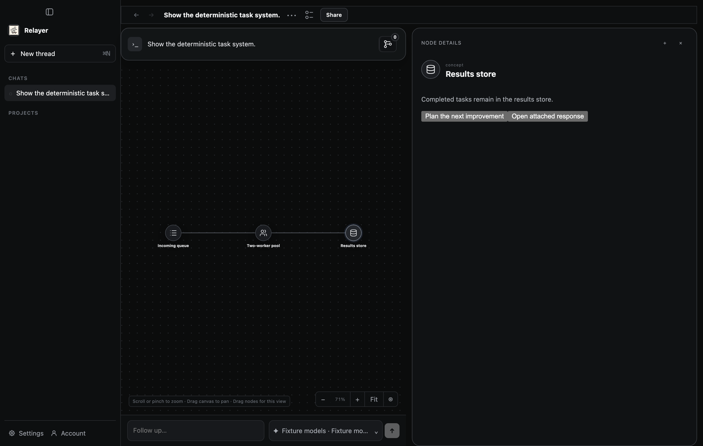
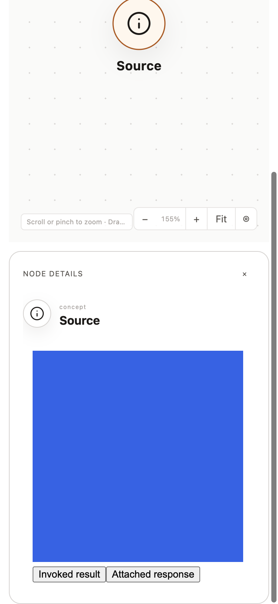
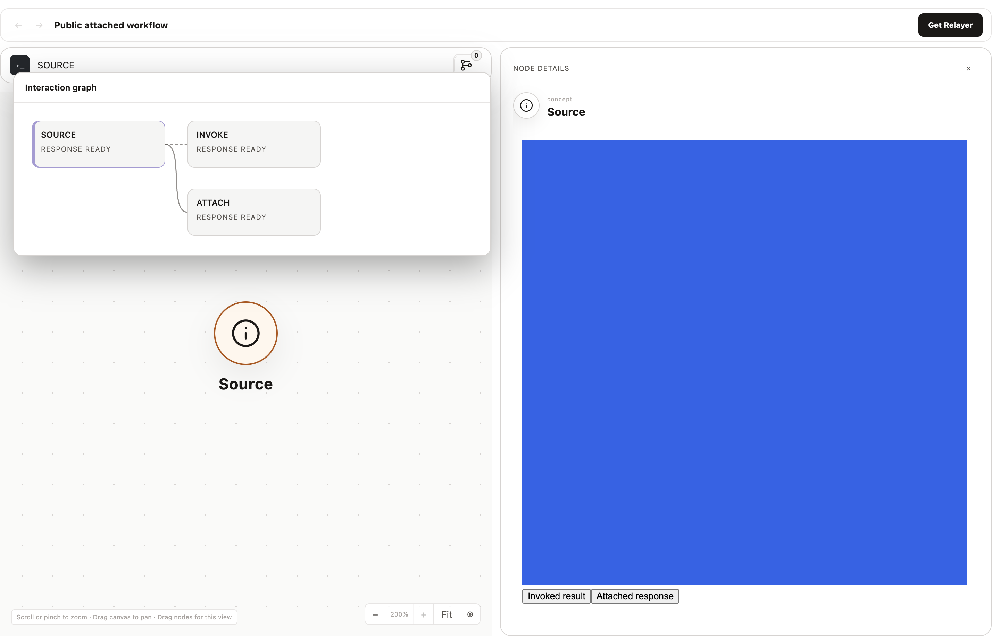
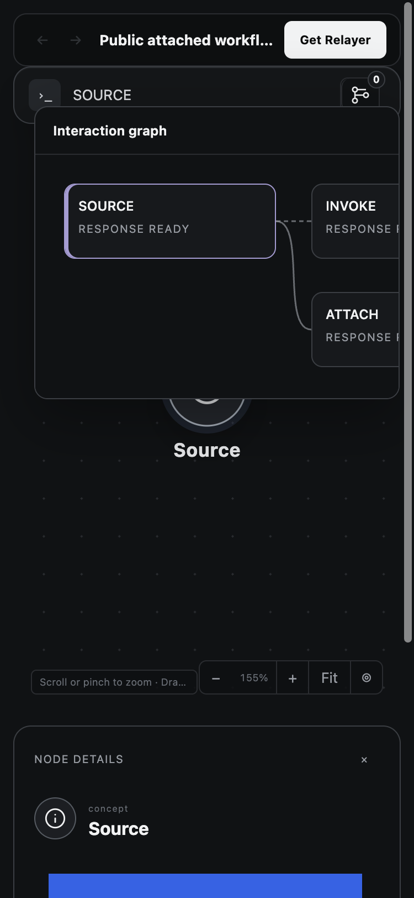

# Attached workflow and V3 portability rollout — PR #604

This extends the earlier navigator-only snapshot. Its historical evidence remains in
`../default-interaction-navigator/README.md`; those source-review assertions do not
certify the expanded change. PRD §7.2B and ADR 0011 define current accepted snapshots,
not historical HTML replay. No test was deleted; replaced export-rejection assertions
are superseded by positive V3 behavior and invalid-shape/authority rejection tests.

## Required plan and changed executable seams

| Promise / failure boundary | Checkpoint | Production seam and deterministic observation |
| --- | --- | --- |
| Packaged and development Desktop prepare new native permissions by default; generic hosts retain opt-in | AN-001/008 | Desktop factory used by main; temporal-runtime spawn test observes process arguments; first-message default and explicit-off journeys |
| Old frozen preparations, missing grants, terminal and read-only contexts cannot gain authority | IP-001/002, AN-001/008 | `typed_permission_storage_is_immutable_and_unknown_versions_fail_closed`, `required_attached_navigation_preserves_old_and_disabled_preparations`, `typed_imported_invoke_cannot_gain_authority_through_writable_occurrence` in full check |
| Current roots never mix revisions during one export | AN-004 | Core multi-root read transaction concurrent-commit regression; snapshot revision pins and atomic revision-checked asset metadata/body reads; real attached asset replacement, authenticated batch/asset routes, runtime response identity/cardinality and bounded whole-capture retry tests |
| Converted and attached navigation, current rich details and pinned assets survive export/import/re-export | AN-003/004 | Real graph/Product/Eval attached-portability E2E; export-contract and core import tests; missing V3 asset test |
| Imported provenance is inert; wrong conversion target/origin, root marker and execution remain denied | IP-003, AN-001/004 | Contract validators, import-owned conversion table, immutable imported actions and E2E send denial; durable provenance-only layer markers, migration backfill, native-after-import target rejection, reopen and cleanup |
| Imported authored keys remain durable and collision-safe without changing package bytes | AN-003/004 | Import-owned key tables; real repeated-key E2E plus `imported_converted_invoke_reopens_as_inert_navigation_and_is_removable` (reopen, key projection, scope, immutability and cleanup) |
| Public compiled controls retain exact aliases and integrity without private authored keys | AN-004 | Share binding projection tests, public snapshot parser and real compiled-control E2E |
| Older formats and published shares remain readable; V3 never goes to an incompatible pinned viewer | AN-004 | V1/V2 contract suite, companion service reservation-version checks and paired artifact verifier |
| Navigator topology, pending statuses, root reset, Back, keyboard, approval and reopen | AN-005/006 | Navigator/controller tests plus native context, restart, approval, first-message and layout heavy entry points |

Required deterministic heavy gates: `npm run check`, `npm run build`, compiled Eval,
Prime visual integration, first-message in both modes, interaction-context lifecycle,
project restart, approval and interaction graph layout. Visual captures must be inspected.
The new E2E uses real graph and Product servers with deterministic fixture completions;
it makes zero paid provider calls. Hosted deployment and signed desktop release remain
separate operations. The service must deploy with the exact V3-capable viewer before a
desktop release publishes V3 shares. Neither a source merge nor local proof updates it.

## Implementation results and retained progression

- Initial expanded build passed after integrating `origin/main` at `f9ce3209b`.
- Focused core snapshot, batch route and runtime client passed; export contract 26,
  imported graph 16, node-detail renderer 50 and share bindings 6 passed at their
  respective implementation snapshots. Final source qualification remains pending.
- Default native first-message: inner passed true, typed permissions true, native
  keyboard true, required-navigation omission rejected and repaired, Product/Eval/reopen
  controls navigated, no ancillary failures, zero inference calls.
- Companion service: 103 tests and TypeScript passed, including exact contract parity.
  Its source is a separate PR; final paired artifact verification is pending.

## Retained failures and repairs

- Initial expanded full check caught one missed `ImportedAction` test initializer in
  the Ladybug search suite. Added explicit false conversion provenance; all-target
  Clippy passed afterward. This is not a full-check pass.
- Initial exporter focused run passed 32 and failed one because the new missing-asset
  error changed the established public error text. Restored that public text and added
  a separate V3 local rejection assertion; legacy local metadata fallback remains.
- Initial real portability E2E found duplicate authored layer keys across distinct
  native completions. V3 closures legitimately combine those scopes. The fixture is
  retained to verify portable identity and import behavior; V3 now preserves scoped authored keys with distinct portable identities. Import-owned key provenance retains exact compiled packages while storage keys remain unique. The same real fixture passes after repair.
- Native fixture setup previously depended on an environment flag instead of frozen
  input permissions; it now follows the actual production input description.
- Artifact builder refused dirty source as designed. No provenance guard was bypassed;
  final artifact verification waits for the tested source commit.

- Joined real runtime/Product/Eval portability E2E passed: converted invoke plus attached
  rich SVG controls, repeated authored keys, ordinary V3 export/import/re-export,
  inert imported history, public aliases and compiled navigation, and a second pure
  attached-edit journey without conversion provenance. Five fixture completions,
  zero provider calls; both journeys passed in 5.8 seconds.
- Prime visual integration: 2/2; compiled Eval runtime: 4/4.
- Explicit-off native first-message passed with typed permissions false and no ancillary
  failures. An earlier incorrectly named environment variable reran enabled mode;
  only the corrected `RELAYER_TEST_INTERACTION_PERMISSIONS=0` run counts as off proof.
- Interaction-context lifecycle passed its inner zero-inference success check.

The native reopened capture below was inspected: both existing and added buttons are
visible in Node Details, with the navigator present. This is local deterministic UI
proof, not signed-release or human acceptance evidence.

- Independent review found and repaired V3 root Reference backlinks incorrectly rejected
  as mixed arrivals. Rust contract 28/28 and public viewer 46/46 passed; nonroot mixed
  arrivals, V1/V2 behavior and expansion cycles retain explicit negative coverage.
- Review found imported V3 could downgrade when neither native mutation provenance nor
  converted/layerless actions remained. Re-export now retains the stored import version;
  V3 asset checks remain strict. Published import version storage has deterministic proof.
- Review found source-layer provenance outside the exported closure could index a missing
  mapping. Import now materializes inert provenance records and validates key conflicts;
  final core/E2E proof is pending. These records add no response topology or grants.
- Expanded full check next reached Product persistence and found an obsolete converted-
  export rejection expectation plus a no-accepted-root mock read. The expectation now
  observes real V3 export/share; empty root inventories need no graph snapshot read.
  An intermediate replacement test used the wrong decoder return shape and failed
  compilation; repaired before rerun. No passing full-check claim yet.
- Project restart evidence exposed unreliable pointer delivery. Focus-only and pointer
  movement retries failed; the driver is being repaired without removing hover assertions.

- Final joined portability fixture passed with real companion service handlers from
  [Relayer #411](https://github.com/vishaltandale00/Relayer/pull/411), source `fddecf52`.
  Desktop transport published actual V3 bytes, recovered a lost finalize response, and
  retrieved the immutable public HTML. No network publication occurred; backing storage
  and auth keys were isolated test fixtures. External source provenance and marker-free
  imported V3 re-export passed in that same run (6.36 seconds).
- Core imported suite 17/17 passed, including external provenance, missing target and
  provenance-only target rejection, immutable key ownership, reopen and cleanup.
- Product persistence 38/38 passed after the expectation/empty-root fixes. The input-
  draft scenario took over 60 seconds under host load; no timeout or assertion was removed.

- Public V3 Chromium capture passed four cases: light/dark at desktop/mobile sizes,
  pinned SVG available, both converted and added controls enabled and navigating to
  their exact destinations, URL unchanged and no external network requests. Captures
  were visually inspected. Initial hidden-window capture returned blank painted frames
  despite functional checks; showing without focus and waiting two frames repaired
  capture synchronization. The earlier output is not counted as visual proof.
- Full check attempt 3 was interrupted by SIGTERM during graph query conformance when
  this chat received a new user turn. Completed test output is retained; the whole
  command is not a pass. A clean full rerun is in progress.

- Final project restart runner passed inner `passed`, `restartPersistence` and
  `layerSelectionRestartPersistence` with all original hover, focus, draft and selection
  assertions retained. Its driver uses hidden Electron windows and consistent Chromium
  pointer dispatch. Unexpected earlier visible-window closes remain unexplained; user
  confirmed no manual closing. The repair avoids foreground interference and does not
  certify physical OS pointer input. A painted hover capture was inspected.
- Native approval runner passed: accepted final status, queue/history/layout/session-grant
  assertions and zero inference calls. Layout runner passed bounds, resize/sidebar,
  scrolling, selection, dismissal, light theme, active origin and legacy placement.

## Final independent source review

Manifest `source-manifest.json` contains 54 changed source/test/spec files; evidence
outputs and this ledger are excluded. SHA-256:
`a9cebb9972d6e712e4563839c35b1e5a1d53476792be18c3d6d4092f30b46c9d`.

- `/root/navigator_standards`: all hashes verified; PASS for standards, imported
  authority/provenance, current export coherence, test subsumption and PRD/ADR mapping.
  Independently reviewed the hidden-window/CDP driver; no assertion weakening and no
  unresolved source findings.
- `/root/portable_import`: all hashes verified; PASS for coherent export snapshots,
  asset failure boundaries, public aliases, Desktop policy, V3 Rust/JavaScript validation,
  compatibility and capture mapping. Native project driver excluded from this review.
  No unresolved source findings. This reviewer did not certify its own import changes.
- Companion `/root/navigator_review`: PASS on 11 changed service files at commit
  `fddecf52b03e542659cd74b887d1b77503de185c`; authority, privacy, format versions, pinned
  old reservations and immutable shares; no unresolved findings. Manifest digest
  `a39e1db55dea8435ee0162797463e6a087ac3281d61ac58292f57daeb4ec9ae0`.

These are source assertions and separately mapped observations, not release certification.
Any manifested source change invalidates the matching assertion. Paired viewer artifact
identity and verification are recorded on the PR after its clean source commit exists.

## Final qualification

`npm run check` completed successfully: workspace Rust, crash reconciliation, all-target
Clippy, package builds/type checks, 240 Vitest files passed and one skipped (3,225 passed,
three skipped), both secret-boundary tests, all 60 Python tests, receipts and PRD lints.
`npm run build` passed afterward. The receipt's upstream-artifact NO-GO wording is retained;
this is not upstream bundle or release certification.

Final default/off first-message runs passed their inner checkpoints with native keyboard
true, no ancillary failures and zero inference calls. Default mode also verified required
navigation rejection/repair and reopened controls. Compiled Eval passed 4/4 and Prime
visual integration 2/2. A final context rerun failed at its focus prerequisite; the fixture
now requests web-content focus after the production workspace has loaded. Its subsequent
standalone result is recorded below; this fixture-only delta follows the full-check run.

The final context rerun passed with zero paid inference calls. Both reviewers reverified
all 54 final hashes after the three-line fixture focus repair. No production source changed
after the successful full check/build. CI must qualify the exact pushed head separately.

Reproduce public visual proof with the joined test's
`RELAYER_ATTACHED_PORTABILITY_CAPTURE=docs/evidence/attached-workflow-rollout/synthetic-snapshot.jsonl`,
then `RELAYER_CAPTURE_ATTACHED_PORTABILITY=1 npx electron scripts/capture-attached-portability-evidence.mjs`.
The optional `RELAYER_PRIVATE_SHARE_SERVICE_ROOT` points at the companion checkout for
in-memory production-handler publication proof. Neither command publishes a live share.

## Batched export timeout follow-up

Review of `dbf704e55d5adc81e4145937cac7bc3fef943360` identified that the coherent
batch request retained a single-root five-second timeout. AN-004 additionally requires
the accepted-closure read to retain the former aggregate per-root time budget. The
client now scales the timeout by root count, clamped to the route limit of 10,000,
without splitting the transaction or weakening response validation.

The existing authenticated HTTP client test now includes a two-root response delayed
by 5.5 seconds. Before the fix it failed with `TimedOut` at 5.01 seconds; afterward it
passed in 5.52 seconds, retaining missing-slot, cardinality and identity checks.
No overlapping test was added or removed.

The updated 54-file manifest SHA-256 is
`2c3b0d37eaebb7c4694d7e05f0bb9f9571883cf95301fe3b44e3bba691661482`.
Reviewer `/root/navigator_standards` reviewed the delta against `dbf704e`, runtime SHA-256
`b30c737cd427f3028ce99f89cea5f262256922b7af18d3a8c61067628c353fde`:
PASS for bounded timeout, authentication, coherence, response validation and retained
regression assertions; no unresolved findings. Earlier assertions remain applicable
only to unchanged files. Earlier native and joined heavy observations are from the
prior source snapshot; this follow-up changes only this timeout and its client test.

Follow-up verification: `npm run check` passed (Rust/Clippy/crash suites, 240 Vitest
files with 3,225 passed and three skipped tests, two secret-boundary tests, 60 Python
tests, receipts and PRD lints). `npm run build` passed afterward. The upstream receipt
NO-GO remains an artifact qualification limit, not a failed implementation check.

## Converted-control navigation follow-up

Late review of `5c4c48102b4b5edfc18ea0ac57f8c09a1badc749` found two gaps in AN-003/004:
imported controls had retained their binding shape but dispatched to a native receipt
endpoint; public converted controls selected the first turn containing a shared layer.
Earlier metadata and callback observations did not prove either downstream behavior.

Changed seams: ProductWorkspace dispatch for imported converted navigation; public
snapshot origin-to-destination indexing and adapter turn selection; realistic joined
Product/Eval test and native public capture assertions. Imported conversions remain
inert accepted layer navigation. Public controls use the validated accepted destination
turn when included, otherwise the current included occurrence. No mutation authority
or new network access is granted.

The public regression failed with expected `turn:2`, actual `turn:1` before repair.
After repair all 47 public viewer tests passed, including omitted-destination fallback
and existing legacy origin tests. Four native public captures now assert the selected
turn and prompt as well as the visible target: converted result selects Turn 2/INVOKE;
ordinary attached Reference retains Turn 1/SOURCE. All four passed with zero external
network requests and zero inference. The PNG bytes remain unchanged because the
capture shows the source controls; the added navigation assertions live in the runner.

The imported regression reproduced the rejected native destination request. After the
imported-only dispatch repair, 56 focused tests passed. The joined fixture now clicks
both compiled controls and ordinary action pills through the production workspace in
interactive Product and read-only Eval, reads the actual authenticated imported layer
endpoint, and observes the rendered result. It asserts no native destination requests;
existing immutable-send and invoke-denial checks remain in place. This replaces no
existing test and reuses the existing realistic fixture rather than duplicating setup.

Final follow-up source manifest: 56 files, SHA-256
`22946def8ec75b681607f723b882c59f95dcfcd6b96c33010b2e3825878ee29f`.
Independent reviewer `/root/navigator_standards` verified every hash and reviewed the
cumulative standards, authority/provenance, coherent export, test subsumption, product
mapping, timeout, imported dispatch, public destination mapping and capture assertions:
PASS; no unresolved findings. Execution results and artifact verification remain
separate evidence; any manifested source change invalidates this assertion.

Final follow-up execution on that manifest passed: full `npm run check` (3,226 Vitest
passed, three skipped; all Rust/Clippy/crash, two secret-boundary, 60 Python and lints),
then `npm run build`. Native default first-message passed with native keyboard true,
Product/Eval/reopened controls, no ancillary failures and zero inference. Compiled Eval
passed 4/4; Prime visual 2/2. The joined real Product/Eval/export/share-service journey
passed against companion `fddecf52b03e542659cd74b887d1b77503de185c`, including both imported
control presentations with real read-only credentials. The final public native rerun
passed all four theme/viewport and exact-turn/prompt checks. The remaining earlier
native off/context/project/approval/layout observations retain their recorded snapshot.
No hosted deployment, paid inference, signed release or source merge was performed.

## Public interaction-graph rollout

Explicit user decision: public shares also replace the turn dial with the interaction
and attachment graph. The earlier public turn-picker scope above is superseded.
Changed seams map to AN-003/004/005/006: native export resolves exact immutable layer
ownership; V3 context sources carry optional included `ownerTurnId`; validation and
import/re-export preserve/remap inert provenance; the public read model groups owners,
layers and targets with validated invocation origins; ProductWorkspace renders the
navigator and same-card selection resets the response root. No outside conversation
metadata or mutation authority is exported. Missing ownership remains incomplete.

The smallest deterministic observations are Rust context-owner contract and exporter
cases, the joined Product/Eval/service export/import/re-export test, and public parser/
adapter/production-workspace tests. The decisive ownership case has A owning a layer,
B presenting it, and C attaching from B: the only attachment edge is A to C. Coverage
includes grouped/deduplicated contexts, old format partial graphs, out-of-inventory,
later, conflicting and wrong-membership claims, and native/read-only control retention.
No tests were removed; turn-picker assertions now assert graph rendering and equivalent
navigation through graph cards. The legacy popover fitter is excluded from graph layout.

Focused public tests passed 56 cases. The native attached-viewer runner passed all four
light/dark desktop/mobile variants, verifying graph edges, card navigation, result turn/
prompt, assets and controls, unchanged URL and zero external requests. The refreshed
V1 public-viewer runner passed nested navigation, graph selection, reload and mobile pan
with three captures. All are local zero-inference proof, not human acceptance.

Retained failures: the first mobile graph capture clicked an off-screen trigger after
reading details. Visual inspection caught the cropped popup; the strengthened runner
now scrolls the trigger into view and checks all four viewport bounds before capture.
The first updated V1 runner used a turn ID from another fixture; it was repaired to use
its own declared synthetic IDs. Independent review also caught V3 promotion after legacy
asset fallback; final proof must include owner-only V3 missing-asset rejection.

The V3 ordering fix now determines owner-derived snapshot policy before any asset
collection. Its runtime-backed regression rejects missing asset metadata with ownership
as the only V3 trigger, while retaining the legacy fallback assertion. Exporter tests
passed 35/35 and the owner contract suite passed 30/30. The first full check caught an
unused production wrapper now called only by tests; `#[cfg(test)]` fixes that boundary
without suppressing warnings. The full-check rerun is tracked separately.

Reviewer `/root/navigator_standards` verified all 59 file hashes in source manifest
`9e3b71804646900ff22b69af4342f0b748bf77ef636cd63decd038ad85102477`.
Reviewed cumulative scope: authority, ownership export/import/remapping, V3 asset policy,
privacy, public graph projection, legacy incomplete graphs, root reset, capture checks,
test subsumption and PRD/ADR mapping. Verdict: PASS; no unresolved findings.

Final execution on the 59-file manifest passed: `npm run check` (3,235 Vitest passed,
three skipped; all Rust/Clippy/crash suites, two secret-boundary tests, 60 Python tests,
receipt and PRD lints), followed by `npm run build`. Final joined Product/Eval/V3/service
portability rerun passed against `fddecf52b03e542659cd74b887d1b77503de185c`; compiled Eval
passed 4/4 and Prime visual 2/2. Public graph and V1 native capture results above observe
the same final renderer source. Earlier native Desktop first-message and other unrelated
heavies retain their previously recorded source snapshots. Exact pushed-head CI and the
clean paired viewer artifact are recorded in the PR after committing.

## Review hardening after public navigator

Changed seams map to AN-001/003/004 and IP-003. Snapshot closures now pin each
included authored node's presentation revision inside the coherent read transaction.
Authenticated asset metadata and body reads compare that pin within the transaction
that reads the asset. A concurrent replacement discards the partial export and retries
its entire capture, at most three times. Continuous mutation fails explicitly; privacy
omission, digest deduplication and metadata-based size preflight remain intact. These
revision pins are internal transport metadata, never exported grants or JSONL fields.

Imported external source-layer placeholders now carry durable import-owned markers.
Normal layer reads, ownership and native navigation targeting exclude those records;
compiled bindings retain their exact provenance keys. Migration 0029 backfills prior
empty imported provenance records and prevents targets or topology being added to them.
The real native-after-import regression failed before the repair, then passed after
reopen; migration, binding and cleanup tests cover the separate storage boundaries.

Focused asset tests observe real concurrent attached acceptance replacing an asset
between closure/metadata capture and its body read, rejection of the stale pin, and
fresh multi-root capture. Authenticated HTTP tests cover both metadata and body reads.
The asset-loop scenario retains privacy/preflight/deduplication checks and bounded
retry behavior. A separate builder regression exercises both ordinary and public-share
export through the real Product store and authenticated runtime client: it changes the
returned graph after a stale read, observes two closure captures, and verifies only the
new presentation and asset bytes occur in the decoded export. During the edit loop, a draft duplicate asset case was replaced by the real
replacement race; no committed test or distinct failure boundary was removed. The first new race fixture used an
invalid null source-layer binding; its retained failure was repaired with the exact
existing source-layer provenance, without changing production validation.

Full-check, build, joined portability and independent final-source evidence for this
follow-up are recorded below only after execution; prior passes above certify their
own recorded snapshots.

Reverse invocation validation now rejects an included accepted result whose converted
source action is already present but whose action origin was erased. The same rule is
applied by the Rust import contract and public parser. Repeated presenting occurrences
of the same source action remain valid, and a source-only snapshot need not include an
external result interaction. These checkpoints preserve exact lineage without guessing
an owner from first occurrence or exporting unrelated conversation metadata.

The builder regression initially omitted a required temporal-feature fixture field;
the original failure is retained separately. The corrected scenario passed for both
export builders. Reverse-origin fixture repair corrected an optional client-key type;
no production rule or assertion was relaxed. These are test setup failures, distinct
from the reproduced pre-fix native-target authority regression.

Final source manifest: 61 files, SHA-256
`58ac99645747f9d0bb8c47a131f9d79291e74e07952217c28cbb4b4f5e73d419`.
Independent assertions for this exact source:

- `/root/portable_import`: PASS, no unresolved findings for asset snapshot pins,
  transactional metadata/body reads, whole-export retry, V1/V2/V3 compatibility,
  privacy/preflight and checkpoint/test-subsumption mapping. Seven-file scope digest
  `df84f4400337099cc7b0632a7f1ffae5c3f10b6292bb0ee057a278d5569fa832`.
- `/root/navigator_review`: PASS, no unresolved findings for provenance-only marker
  visibility, import/migration, native targeting, compiled binding projection and
  cleanup. Nine-file recorded scope digest
  `2ff0913f19131fe65ea4ccce0c729f3c3bddf3585e73c9dd9a2a212e7b00d30e`
  also includes that reviewer's origin implementation; only the marker scope is
  independently reviewed by this reviewer.
- `/root/navigator_standards`: verified all 61 hashes; PASS, no unresolved findings
  for the independently reviewed Rust/public reverse-origin validators and regressions,
  reused source attribution, omitted external results, and cumulative checkpoint mapping.
  Its own asset implementation is covered by the separate portable_import assertion.

These source-review assertions do not substitute for test execution. Any source change
invalidates the affected assertion. Public viewer focused tests passed 58/58; Rust
contract tests passed 30/30 with a later focused reuse assertion pass. Full execution
and artifact pairing are recorded after the final source run.

Final execution on the 61-file source manifest passed: `npm run check` (3,237
Vitest tests, three skipped; 240 files passed, one skipped; all Rust/Clippy/crash
checks, two secret-boundary tests, 60 Python tests and lints) and `npm run build`.
The joined Product/Eval/export/import/re-export/share-service journey and Prime visual
suite passed three tests against service commit
`fddecf52b03e542659cd74b887d1b77503de185c`. Compiled Eval passed four tests.
The refreshed synthetic snapshot then passed four native public-viewer theme/viewport
captures, including exact graph edges, selected result turn/prompt, assets, controls,
stable URL and zero external requests/inference. Desktop-light and mobile-dark graph
captures were visually inspected. Earlier unrelated Desktop heavy evidence retains
its original source attribution above. No paid inference or deployment was performed.
