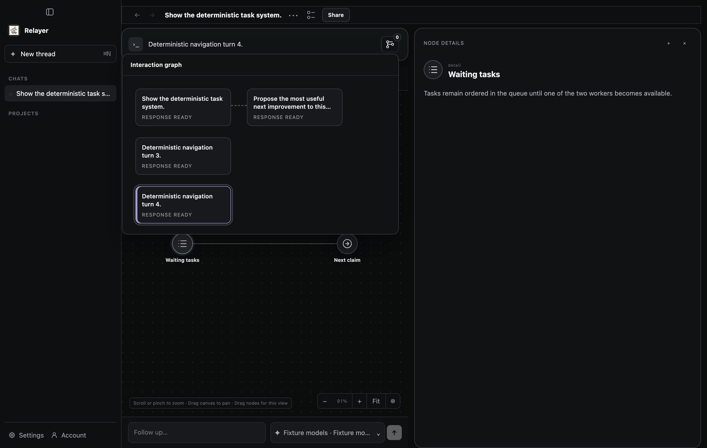

# Default interaction navigator

The user requested a PR enabling the interaction navigator in packaged Desktop.
The rollout changes read-only discovery, not the default-off permission gate.
PRD §7.2B and ADR 0011 record that distinction.

## Changed executable seams and required verification

| Seam / promise | Checkpoint | Smallest deterministic observation |
| --- | --- | --- |
| Graph-server authenticated feature discovery advertises navigation independently of mutation permissions | AN-005/006, IP-004 | `cargo test -p relayer-graph-server --test interaction_features`; checks authentication, both permission modes and unchanged default-off authority |
| Native Product metadata continues to derive exact layer ownership and invocation origins with scope, failure handling and imported exclusion with feature discovery enabled | AN-005 | `cargo test -p relayer-app-server --test product_persistence_flow interaction_graph_` |
| Frozen preparations and permission authorization remain unchanged | IP-001/004, AN-001/008 | Existing core `typed_permissions_freeze_exact_combined_authority_and_reject_false_provenance` and `required_attached_navigation_preserves_old_and_disabled_preparations`, included in full check |
| Supported native workspace uses closed-by-default B3; absent metadata retains legacy picker | AN-006 | `npx vitest run test/interaction-graph.test.mjs test/interaction-graph-workspace.test.mjs` |
| Native evidence drivers select visible graph cards instead of removed arrows; keep current-root reset, Back, keyboard, pending-confirm and restart boundaries | AN-006, interaction-context lifecycle | First-message in both permission modes; interaction-context lifecycle and project-new-thread restart |
| Existing approval and capture drivers use the same native navigator | AN-006, approval presentation | Desktop approval runner; syntax checks for optional capture scripts (live capture is not authorized by this rollout) |
| Layout and keyboard dismissal remain usable | AN-006 | `npm run test:desktop:interaction-graph-layout`, inspect generated images |

Required final gates: `npm run check` and `npm run build`. Run zero-inference
first-message in both permission modes, interaction-context lifecycle,
project-new-thread restart, approval and the layout runner. Compiled Eval's
node-control qualification is not newly required: no node controls change.
The first-message journey still exercises native read-only Eval navigation.
Imported threads retain their existing exclusion and legacy navigation.
No tests are deleted. The new route test covers real capability discovery;
existing app-server fixtures cover provenance projection rather than duplicating it.

No paid inference, installed-app modification, signing or release publication is
part of this PR. A new release is required before the installed app changes.

## Build preparation

Node 22.23.2 and lockfile dependencies. Compatible trusted native caches were
checked before compilation. `/tmp/relayer-0816-lbug` and the share-embed-slice-one
Ladybug bundle were rejected by the repository verifier because their Cargo.lock
identities did not match (initial invocations also exposed differing platform or
Rust-release naming). Neither rejected bundle was used. Existing local Cargo
outputs were copied with APFS cloning as a compilation accelerator; Cargo still
rebuilds current inputs and the pinned Ladybug source. Changed Rust inputs prevent
reuse of a whole-runtime bundle as current binaries. No tests are cached.

## Actual results

Initial `npm run check` passed at `caf53d45`: Rust formatting, Clippy,
workspace/default and crash-reconciliation suites; package builds and type checks;
238 Vitest files passed and one skipped (3,171 tests passed, three skipped);
both secret-boundary tests; all 60 Python tests; receipt/contract and PRD lints.
The receipt lint reports upstream artifacts NO-GO; it does not qualify an upstream
artifact or a desktop release. Earlier failed attempts remain recorded below.

Initial observations at `caf53d45`:

- `npm run build`: passed.
- Real feature-route regression: reproduced `false` versus expected `true`
  before the change, then passed with authentication and both permission modes.
- App-server provenance, budget and imported-fallback projection cases: 2/2.
- Default and permission-enabled native first-message journeys: inner
  `passed:true`, `nativeKeyboardVerified:true`, zero inference calls and empty
  ancillary-failure lists in both modes. Root reset and Back passed.
- Native project-new-thread: inner `passed:true`, restart persistence and layer
  selection restart persistence both true.
- Native approval journey: passed, including navigation to the prior response
  with the approval dock preserved.
- Context lifecycle: passed after the fixture repairs described below, with the
  explicit inner zero-paid-inference success marker.
- Missing optional IPC-handler messages remain visible in the Electron logs;
  these journeys do not certify those omitted integrations.

The native default-mode image below was visually inspected. It demonstrates the
navigator with mutation permissions off; it is not signed-release or human
acceptance evidence.

- Renderer tests: 3/3; navigation/history/keyboard tests: 140/140.
- Layout runner: all 13 captures and inner assertions passed; expanded desktop
  image inspected.
- First capture-integrity run: 128 passed, one skipped, one failed. The sealed
  private Homebrew Node closure test exceeded its existing 30-second limit while
  native compilation was running. This failure is retained; resource contention
  is a hypothesis, not a proven cause. No timeout or assertion was weakened.

## Independent source review

`/root/navigator_review` (Spec/authority) and `/root/navigator_standards`
(Standards/scope) each verified all 15 hashes in `source-manifest.json`, SHA-256
`d1d5977f649176379efd71e23614f99becfa34b7a5120ca9b02bb8749918b81c`.
Both passed with no unresolved source findings. Scope: authenticated feature
advertisement, unchanged mutation authority and fallback, PRD/ADR meaning,
route regression, imported-thread omission with a retained graph ID, and evidence-driver adaptations. The standalone Ask capture
initially imported a helper missing from its authenticated bootstrap inventory;
review caught it, and the helper now remains local to the authenticated script.
The final reviewed snapshot includes that correction and the local non-accepted
turn-selection repair below. Both reviewers checked membership discrimination,
accepted-only response reset, provenance guards and hydration/history tests.

These are static source assertions, not runtime or screenshot certification.
The evolving evidence ledger is excluded. Changes to any manifested file
invalidate both assertions.

Additional retained observations:
- The added import scenario initially reused a closed setup pool and failed with
  `PoolClosed`. Reopening the fixture pool corrected setup; both projection
  scenarios then passed in 0.99 seconds. Production code was unchanged.
- The first full `npm run check` passed Rust/default/crash, build and type stages,
  then stopped in Vitest: 3,170 passed, three skipped, one failed. The existing
  provider-PID-publication fixture's `spawnSync` exceeded its two-second timeout
  (`ETIMEDOUT`). Concurrent builds in other worktrees were observed; causation
  is unproven. No test deadline, assertion or permission boundary was weakened.

- Context lifecycle initially failed before the changed navigation steps: the
  window was hidden and unfocused, and the checkout used as its project produced
  a 266,519-byte staged Git listing above the unchanged 262,144-byte limit.
  Instrumentation confirmed the visibility/focus failure; after focus repair,
  the real environment response exposed `git_output_too_large` and backoff.
  The fixture now shows/focuses the native window and waits for those conditions,
  then uses a small temporary Git project through the same real Product APIs.
  All original five-second cadence, editor, pending-confirm, keyboard, history
  and restart assertions remain. The repaired journey passed; debug logging was
  removed. No product limit or timer was changed.
- The provider-PID-publication test passed unchanged in isolation (221 ms).
  That isolated result does not erase the first aggregate failure.
- A final-check attempt stopped at rustfmt's line wrapping in the new imported
  assertion. Formatting was applied before the final full run.

## Merge-readiness review repair

GitHub review found that enabling B3 hid the old arrows while non-accepted cards
were disabled. Local failed, stopped, running and pending turns could not be
reached by mouse or touch after selecting an accepted response.

The graph now distinguishes actual turns from provenance-only sources by
membership in the thread's turn collection. Local cards remain selectable;
only accepted selection requests a response-root reset. Non-accepted source-only
cards remain disabled, even when they share the current thread ID. PRD §7.2B and
ADR 0011 clarify preserved local status navigation; mutation authority is unchanged.

Changed seams map to AN-006: workspace DOM tests click each of the four local
states and retain disabled-source, disclosure, keyboard and accepted-reset checks.
Controller integration tests observe hydration and Back/Forward without a stale
accepted response. The four workspace cases failed before the repair; the focused
three-file portfolio then passed all 55 tests. No test or deadline was removed.

Required final verification: full check and build, layout, native first-message
in both modes, context lifecycle, project restart and approval. Final execution results are recorded below; source-review assertions above do
not certify those runs.

The final native reruns passed both first-message modes (inner success, keyboard,
zero inference and no ancillary failures), project and layer-selection restart,
approval, all 13 layout captures, and context lifecycle. Layout/default screenshots
retain the prior appearance; the changed availability is exercised by the four
real workspace DOM cases.

Context initially timed out at native Tab, then the next attempt failed the
existing focused-window startup assertion. The macOS runner now activates the
application as well as the window, and verifies actual focus before its native Tab
event. All original timing, keyboard and editor assertions remain. The repaired
full journey reports zero paid inference calls. Both source reviewers renewed
their assertions for this fixture update.

A merge-readiness aggregate attempt passed 3,177 Vitest tests but failed one Eval
startup because it could not resolve `@relayer/harness-host`. An overlapping
`npm run build` cleared package outputs while that test loaded them. Build
completed successfully; the final full check passed without an overlapping build.
No assertion or timeout was relaxed. This failed attempt is retained separately
from the final aggregate result.

Final `npm run check` passed on manifest
`d1d5977f649176379efd71e23614f99becfa34b7a5120ca9b02bb8749918b81c`:
238 Vitest files passed and one skipped; 3,178 tests passed and three skipped;
both secret-boundary tests; 60 Python tests; Rust formatting, Clippy, workspace
and crash-reconciliation suites, builds, type checks, receipt and PRD lints.
`npm run build` passed on the same source before that final check. The final
native screenshot was inspected and matches the checked-in visual evidence.
The source reviews and native results above apply to this manifested source.
