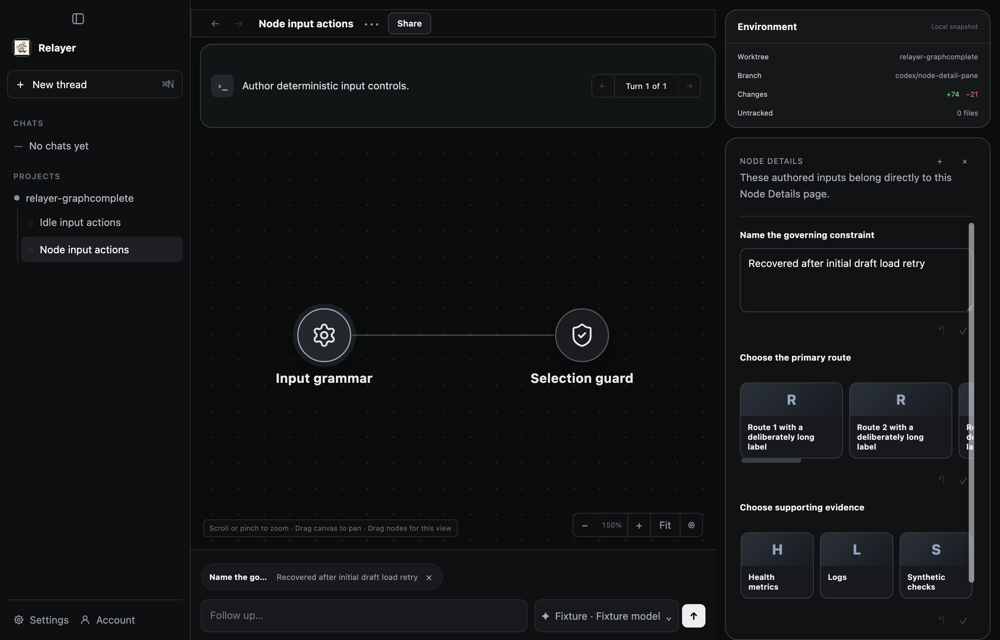
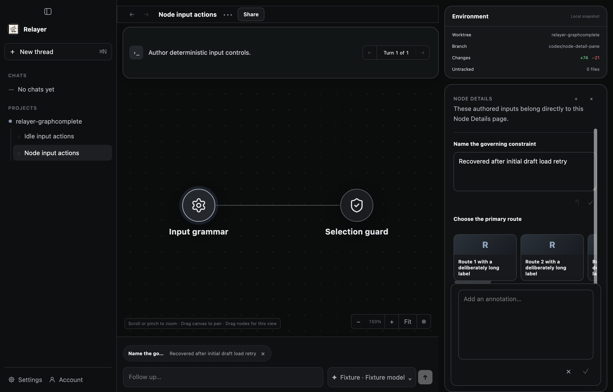
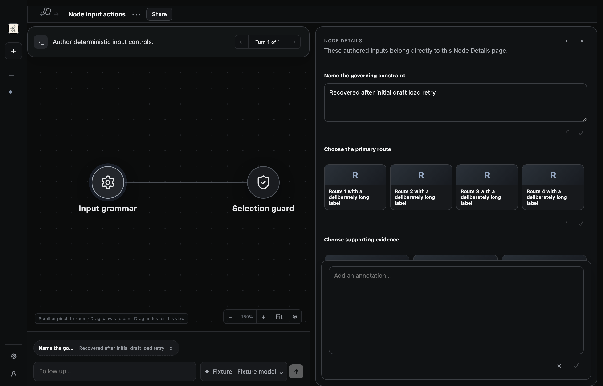
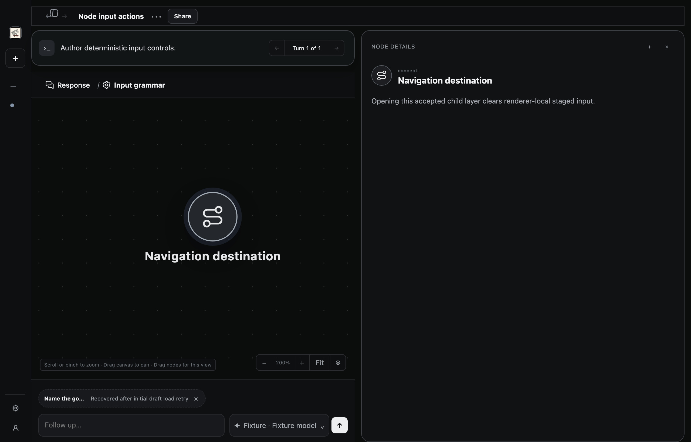

# Node detail pane evidence

The user accepted this layout after inspecting the local Electron result.

## Product checkpoints

- NDT-001: an authored layer default belongs to that layer; SQLite persistence, acceptance, reopen, and export/import preserve its identity.
- NDT-002: TypeScript and Python authoring clients transport the choice. Compiler descriptors preserve provenance checks. Harness guidance asks agents to choose deliberately; older clients remain compatible.
- NDT-003: opening a nonempty layer selects a detail automatically. Valid remembered selection precedes the authored default. History restoration does not become a new selection intent or retain transient input edits.
- NDT-004: details fill the pane; annotation editing overlays them. Collapsing the sidebar hides Environment, spans the heading across both columns, matches Turn to graph width, and raises the equal-width detail column beneath the heading. Expanding restores the original layout.

The executable mappings and required entry points are in PRD section 7.0.

## Executed verification

The implementation, including the breadcrumb readability follow-up, passed these checks. The subsequent collapsed-icon alignment fix passed build, focused tests, and both Electron runners; its aggregate checks hit two unrelated timing failures, detailed below. This README was finalized afterward without further executable changes.

- `npm run check`: passed for the breadcrumb commit 962db874. For the subsequent centered-icon fix, the first run hit a 500ms Git-environment timeout; the retry passed native checks but hit a 2s provider-wrapper process timeout (2470 Vitest passed, 1 failed, 3 skipped). Both failing tests passed in isolation. The downstream secret-boundary (2), Python (37), receipt lint, and PRD checks passed separately. Aggregate failures remain recorded; they are not an aggregate pass.
- `npm run build`: passed.
- `node scripts/run-node-input-actions-test.mjs`: passed, zero paid inference.
- `node scripts/run-interaction-context-lifecycle-test.mjs`: passed, zero paid inference.
- Focused workspace keyboard, breadcrumb, and environment tests: passed.
- `git diff --check`: passed.

The desktop runners used the separately completed build prerequisite. A trusted Ladybug cache was restored and verified before compilation. Earlier failures during development were repaired; earlier aggregate runs also exposed a concurrent-build artifact race and a provider screenshot capture failure. The aggregate run for 962db874 passed without those earlier failures; the subsequent centered-icon results are recorded above.

Reviewer `/root/review_contract` independently reviewed state, authority, responsive geometry, breadcrumb legibility checks, and test boundaries, with no unresolved identified findings. Runtime results were supplied by the primary agent. The exact source assertion belongs in the PR description; the local review is non-certifying without a PR. Breadcrumb horizontal scrolling is configured but the readability fixture does not exercise a long overflowing path.

## Visual evidence

These are actual Electron captures from the final breadcrumb and layout run:

## Limits

Remembered selection was tested through sidebar reopening and renderer reload. Full application restart onto a different local origin was not tested. No paid inference, live provider, signed release, or deployment proof is claimed.

Collapsed-icon root cause: zero-sized labels retained flex gaps and shortcut spacing while the logo container stayed left-aligned. Before correction, measured offsets were -7px for the logo and -9px for plus. After removing hidden-label spacing and centering the containers, offsets are -0.5px (the one-sided rail border) and 0px, including keyboard focus. The real desktop runner checks these centers.

## Rebase onto current main

Rebased onto ac7657e1. Combined Python client integrity was recomputed and the trusted Ladybug artifact identity and contents were verified. Review found new public-viewer integration seams: the browser artifact now includes the selection module; public selections use per-viewer memory to prevent portable-ID collisions; the snapshot reader validates default-node membership; failed viewer boot disposes pending workspace presentation. Focused tests exercise actual viewer reopen with reused IDs and the artifact dependency closure. Prior evidence above describes pre-rebase source. Fresh npm run check and npm run build passed on the rebased executable source. Both Electron proof runners passed with zero paid inference. The new Share pending IPC was unavailable in these older fixture harnesses and logged a non-fatal handler message; share behavior itself is covered by the public-viewer and share suites in the full check. Screenshots were refreshed from the rebased desktop. This record was finalized afterward without executable changes.

## Merge-readiness review fixes

The three PR review findings are addressed: history restores an explicitly closed detail pane; desktop selection memory uses bounded profile settings across rotating loopback origins; and Environment remains visible when the narrow layout hides the sidebar toggle. Public viewers retain instance-local selection memory. Reconciliation deduplicates desktop writes while failed writes remain retryable. These changes map to NDT-003 and NDT-004.

On the revised executable source, npm run build and npm run check passed (2,629 Vitest tests, 3 skipped; secret-boundary and Python checks also passed). The five focused suites passed 122 tests. Node-input and interaction-context Electron proofs passed with zero paid inference. The project-new-thread Electron proof passed both restartPersistence and layerSelectionRestartPersistence: it reconstructed the settings store, restarted the product server on a different origin, recreated the window, and restored a non-default node. This supersedes the earlier changed-origin limitation; a separate full Electron-process termination is not claimed.

Two first-run fixture failures are preserved: the narrow-window assertion initially hit Electron's 960px minimum rather than reaching the breakpoint; the restart runner initially had no accepted graph because provider admission was unavailable. The narrow fixture now explicitly lowers its minimum for that assertion. The restart fixture admits its first deterministic graph and explicitly fails later attempts to preserve failed-prompt/tombstone coverage. Both corrected scenarios passed. No product assertion was removed or weakened. Nonfatal missing Share-pending IPC messages remain confined to these older fixture harnesses.

Required final verification remains npm run check, npm run build, and the three declared desktop runners. The PR records the final commit, executed results, and adversarial review assertion.
